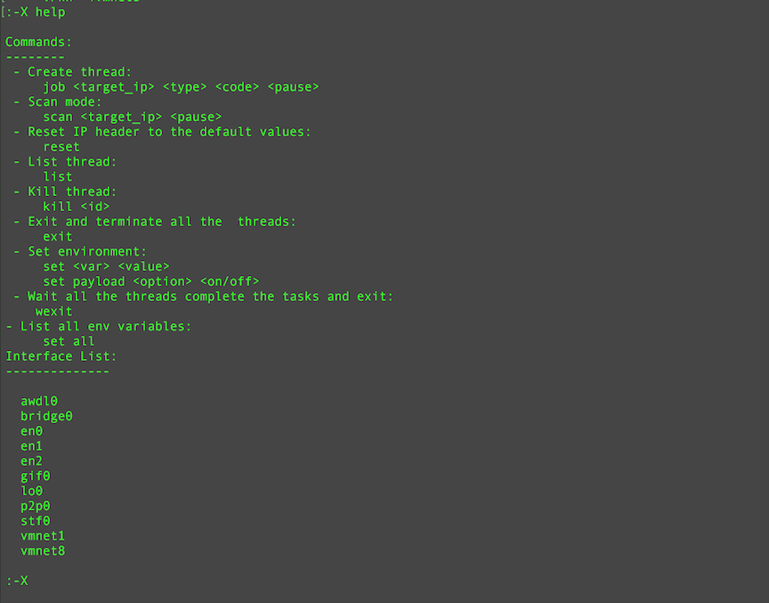
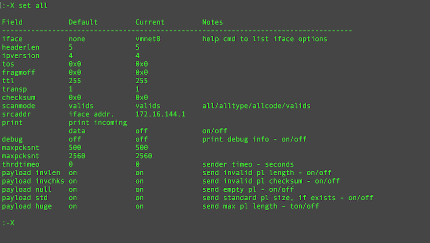

Description:
============

Wh (Wild Horde) is a test/stress tool capable to send heavy network traffic composed by malformed icmp packets.
After the publication of the Blacknurse bug, I was wondering how many network appliance, IOT devices, etc could be affected by similar problems, so I started to write this tool for that purpose and for fun (mostly for fun :-) ).

These are some screeshoots of the wh console: 

DISCLAIMER:
===========

This code has been posted for information and educational purposes. The execution of a Denial Of Service (DOS) attack in systems and services without the owner's authorisation is illegal. The misuse of the information and the software in this repo can result in criminal charges brought against the perpetrator of the crime. Any actions and or activities related to the material contained within this Git Repository is solely your responsibility. The author will not be held responsible in the event any criminal charges be brought against any individuals misusing the information or the software in this website to break the law.

FEATURES:
=========

The syntax is:

  wh [-i<iface>] | [-h]

A configuration file or batch script can be passed via pipe.

The program has its own "shell like" interface: it can be used in three ways:

- batch;
- interactive;
- mixed;

In batch mode, you can pass a configuration file via pipe:

  cat conf.txt | ./wh -ieth0

If the configuration file contains the command "wexit", the program will terminate when all the tasks specified in the configuration file will be executed.
Not specifying "wexit", you are using the mixed mode: after the launch of the batch operation in background an iteractive shell will be available.
If no configuration is specified, the interactive shell will be available instantly.

The program is multihreading and permit to launch jobs in background against multiple targets or against a single target with multiple kind of attack.

Every job get the IP header value, network interface limits and timout constraints fron the  environment. 
You can print/modify the environment with the set command:

- set all print the current configuration:

- To change a value:

  set <var> <value>

a single space is the separator.

All the following jobs will use that configuration for all their execution. Change in the configuration will affect only the new jobs.

- To create a job:

  job <target_ip> <type> <code> <pause>

where target_ip is the ip address of the target, type the ICMP type, code the ICMP code, pause the time in usecond between the dispatch of two packets and can be used to limit the bandwidth / system resources.

- Job control:

The list command print a list of the jobs in execution. A job can be terminated with the kill command using the "pid" specified int he first column of the list output.

- To closhe the shell:

  exit

- Help info

  help 

Prerequisites:
==============

The program is intended to be used in a *nix environment and it is tested on various Linux distributions and OS X:

- RHEL7 Linux  x86_64;
- Ubuntu 16.04 LTS;
- Ubuntu 14.04 LTS;
- Debian 7 ("wheezy");
- OS X 10.11.6;

using, as compiler, one in this list:

- clang version 4.0.0;
- clang version 3.8.1;
- gcc version 4.8.5 20150623 (Red Hat 4.8.5-4) (GCC);
- gcc version 4.8.4 (Ubuntu 4.8.4-2ubuntu1~14.04.3);
- gcc version 4.7.2 (Debian 4.7.2-5);
- Apple LLVM version 6.0 (clang-600.0.57) (based on LLVM 3.5svn)

To compile the program, this tools/libraries are necessary:

- a c++ compiler ( with c++11 support);
- automake/autoconf with libtool;
- libreadline.

Installation:
=============

- launch the configure script:
  ./configure
- Compile the program:
  make
- Install the program and the man page:
  sudo make install

Instructions:
=============

See the man page included in the release.

Trivia:
=======

Why the name "Wild Horde" ? I like "spaghetti western" and a piece of the OST of the film "My name is Nobody" of the great Ennio Morricone is just "Wild Horde". :-)
